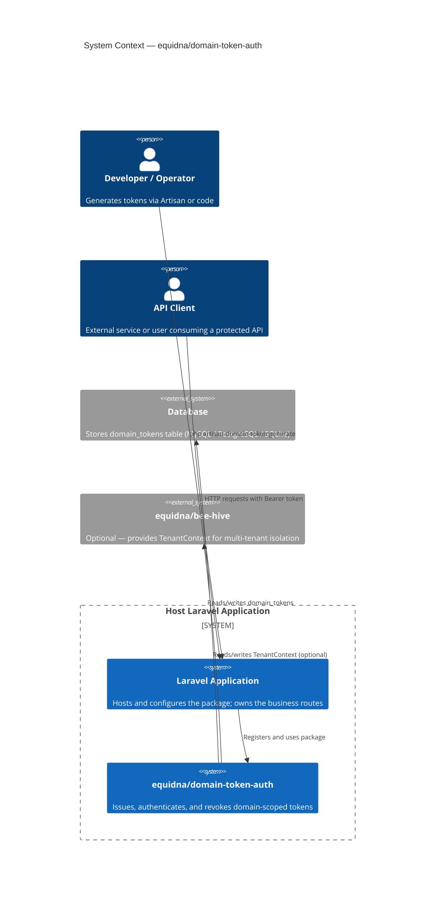
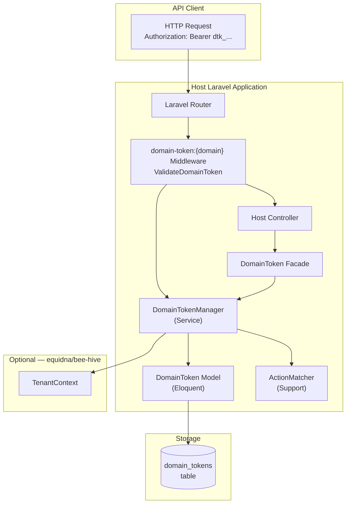
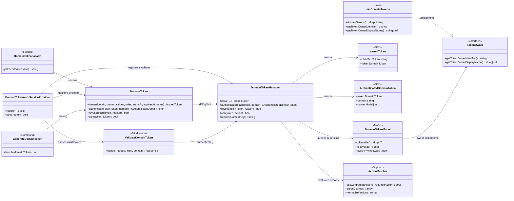
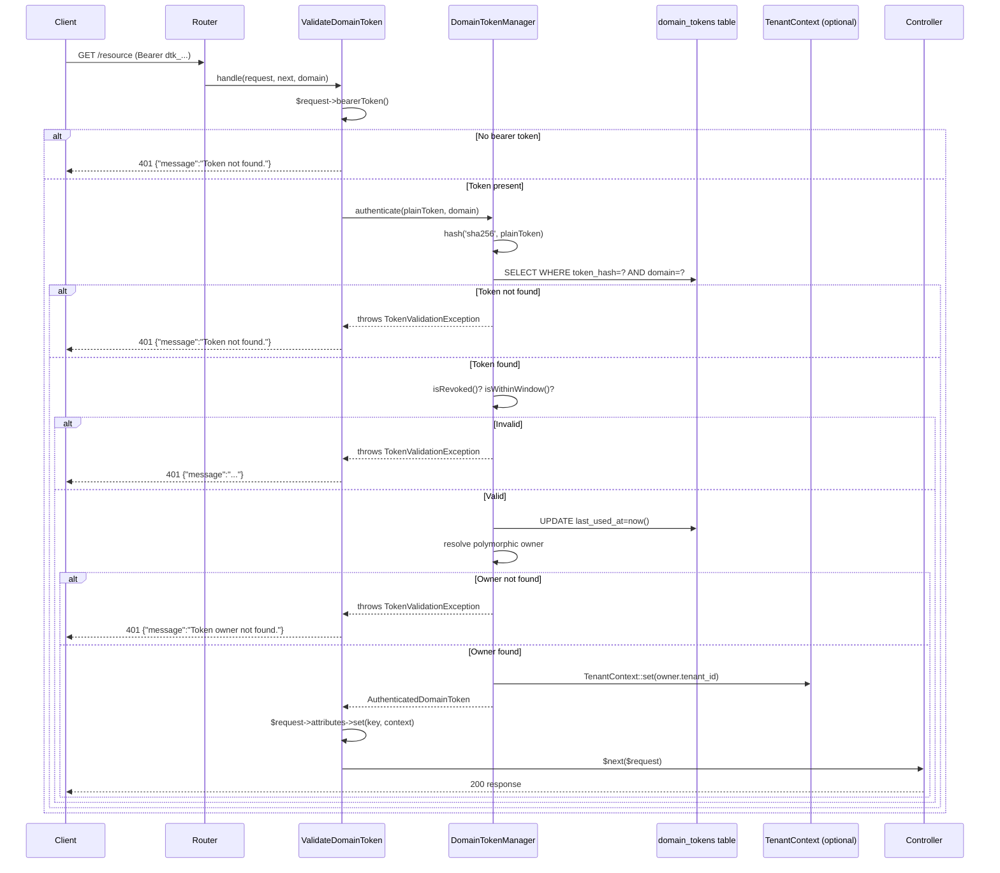

# Architecture Diagrams

All diagrams use [Mermaid](https://mermaid.js.org/).

---

## System Context Diagram

Shows the package in relation to the host Laravel application and external systems.

---

## Container Diagram

Shows the runtime containers involved when the package is active in a host application.

---

## Component Diagram

Shows all classes within the package and their relationships.

---

## Token Authentication Sequence

Detailed sequence for a request authenticated by `domain-token:{domain}` middleware.

