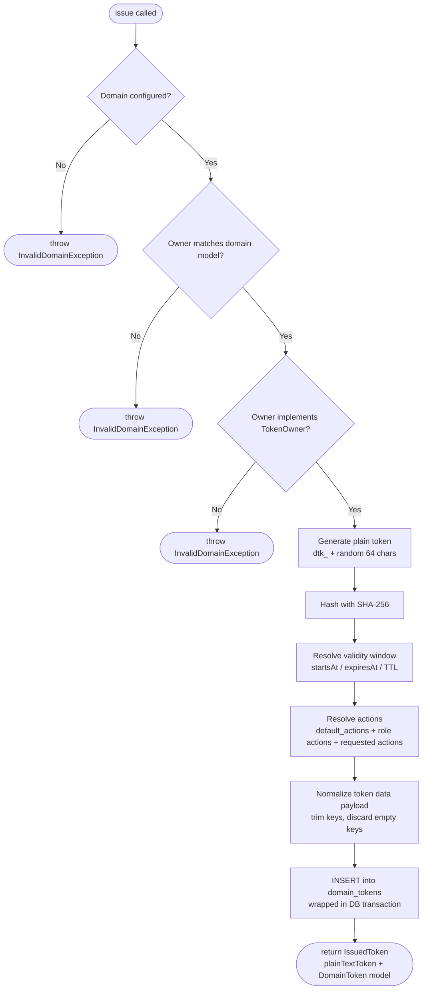
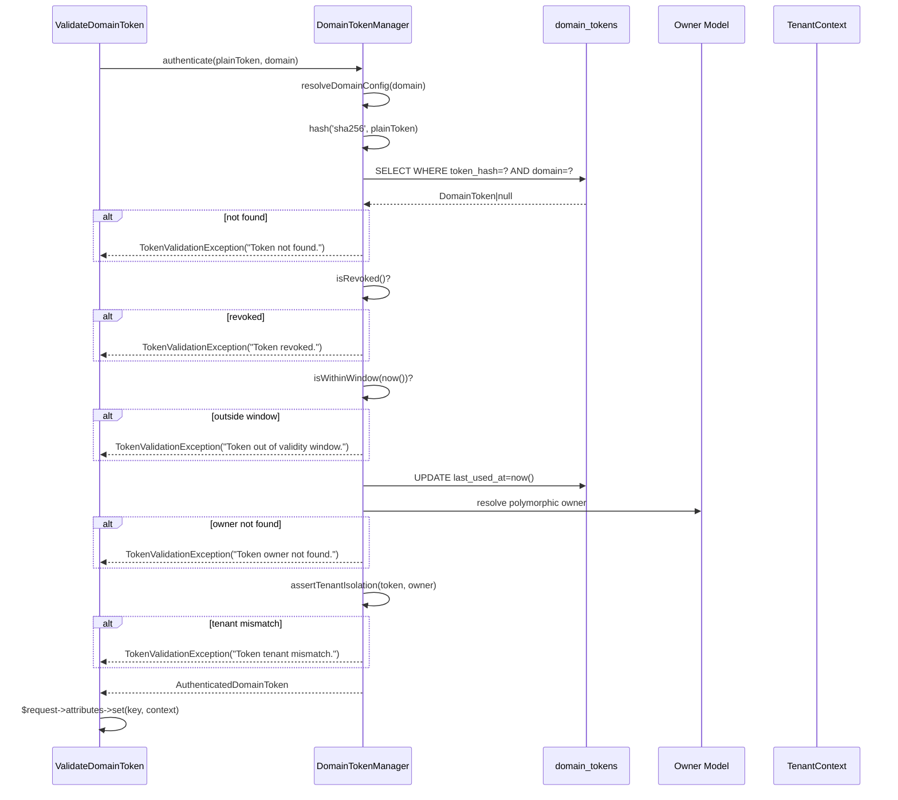
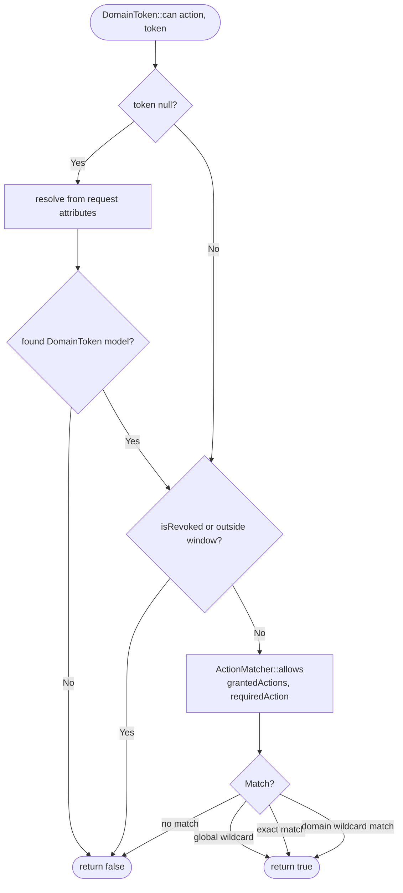

# Business Logic & Core Processes

This document describes the main business processes implemented by the `equidna/domain-token-auth` package.

---

## Domain Concept

A **domain** in this package is a _functional authorization context_, not a web domain name. It groups:

- The type of entity that can own tokens (the `model`).
- The roles available within that context.
- The actions each role grants.
- The default expiration TTL.

Examples: `user`, `app`, `service`, `distributor`, `partner`.

This design ensures that a token issued for an `app` owner cannot authenticate a request protected for the `user` domain, even if the token itself is valid.

---

## Process 1: Token Issuance

**Why it exists:** A caller (code or operator) needs to create a new token tied to a specific owner within a domain, optionally scoped to roles, additional actions, and custom metadata (`data`).

**Main classes involved:**

- `Equidna\DomainTokenAuth\DomainToken` (`src/DomainToken.php`) — entry point
- `Equidna\DomainTokenAuth\Services\DomainTokenManager` (`src/Services/DomainTokenManager.php`) — core logic
- `Equidna\DomainTokenAuth\Support\ActionMatcher` (`src/Support/ActionMatcher.php`) — action normalization
- `Equidna\DomainTokenAuth\Models\DomainToken` (`src/Models/DomainToken.php`) — Eloquent persistence
- `Equidna\DomainTokenAuth\DTO\IssuedToken` (`src/DTO/IssuedToken.php`) — return value

**Step-by-step flow:**

**Business rules:**

- The plain-text token is generated using `dtk_` + `Str::random(64)`. The prefix and length are configurable.
- Only the SHA-256 hash is persisted; the plain-text token is shown exactly once.
- Actions are the union of `default_actions`, role-mapped actions, and any directly requested actions. All are normalized to lowercase.
- Custom `data` payload is stored as JSON and can be consumed later from authenticated context.
- If the domain defines `default_ttl_minutes`, it takes precedence over the global `token.default_ttl_minutes`. If the resolved TTL is zero or null and no `expiresAt` is provided, the token never expires.

---

## Process 2: Token Authentication

**Why it exists:** A request arrives at a protected route. The middleware must verify that the bearer token is valid, belongs to the expected domain, and is within its validity window.

**Main classes involved:**

- `Equidna\DomainTokenAuth\Http\Middleware\ValidateDomainToken` (`src/Http/Middleware/ValidateDomainToken.php`)
- `Equidna\DomainTokenAuth\Services\DomainTokenManager` (`src/Services/DomainTokenManager.php`)
- `Equidna\DomainTokenAuth\Models\DomainToken` (`src/Models/DomainToken.php`)
- `Equidna\DomainTokenAuth\Auth\AuthenticatedDomainToken` (`src/Auth/AuthenticatedDomainToken.php`)

**Step-by-step flow:**

**Business rules:**

- Authentication is always domain-scoped: the DB query filters on both `token_hash` and `domain`.
- `isRevoked()` returns `true` when `revoked_at IS NOT NULL`. There is no un-revoke operation.
- `isWithinWindow(now())` enforces `starts_at <= now()` (when set) and `now() <= expires_at` (when set).
- If the polymorphic owner cannot be resolved (deleted or invalid model mapping), authentication fails with `TokenValidationException("Token owner not found.")`.
- Tenant isolation is enforced by comparing the active `TenantContext` tenant with the owner's tenant ID at authentication time.
- If `apply_tenant_context` is enabled, and no tenant is active, the package sets `TenantContext` from owner tenant ID when available.
- The authenticated context is stored in `$request->attributes` under `_domain_token_auth_context` for downstream access.
- Downstream code can consume metadata via `DomainToken::data('key')` or `DomainToken::context()?->data('key')`.

---

## Process 3: Action Authorization

**Why it exists:** Knowing a token is valid for a domain is not enough. Individual operations within that domain may require specific permissions. This process checks whether a token's action set grants the required action.

**Main classes involved:**

- `Equidna\DomainTokenAuth\DomainToken` (`src/DomainToken.php`) — `can()` method
- `Equidna\DomainTokenAuth\Services\DomainTokenManager` (`src/Services/DomainTokenManager.php`) — `can()` method
- `Equidna\DomainTokenAuth\Support\ActionMatcher` (`src/Support/ActionMatcher.php`)

**Step-by-step flow:**

**Action matching rules (`ActionMatcher::allows`):**

- `*` in granted actions — allows any action.
- `users.*` — allows any action whose first segment is `users` (e.g. `users.read`, `users.write`, `users.delete`).
- `users.read` — allows only the exact action `users.read`.
- All strings are lowercased and trimmed before comparison.

---

## Process 4: Token Revocation

**Why it exists:** A token must be immediately invalidated, for example after a security incident, a user leaving an organization, or a key rotation.

**Main classes involved:**

- `Equidna\DomainTokenAuth\Services\DomainTokenManager` (`src/Services/DomainTokenManager.php`) — `revoke()`
- `Equidna\DomainTokenAuth\Models\DomainToken` (`src/Models/DomainToken.php`)

**Step-by-step flow:**

1. Hash the plain-text token with SHA-256.
2. Look up the `DomainToken` record by hash.
3. If not found or already revoked, return `false`.
4. Set `revoked_at = now()` and `revoked_reason` on the record.
5. Return `true`.

**Business rules:**

- Revocation is irreversible by design: there is no `unrevoke()` method.
- The `isRevoked()` check in `authenticate()` and `can()` relies solely on `revoked_at IS NOT NULL`.
- A revocation takes effect immediately on the next authentication attempt.

---

## Business Invariants

| Invariant                                            | Enforcement point                                                                                                                   |
| ---------------------------------------------------- | ----------------------------------------------------------------------------------------------------------------------------------- |
| Every token must have an owner                       | DB `NOT NULL` on `tokenable_type` and `tokenable_id`; validated at issuance; rejected at authentication if owner cannot be resolved |
| Owner model must match the domain's configured model | `assertModelAllowedForDomain()` in `DomainTokenManager::issue()`                                                                    |
| Owner must implement `TokenOwner`                    | `assertTokenOwnerContract()` in `DomainTokenManager::issue()`                                                                       |
| Plain-text token is never stored                     | Only SHA-256 hash persisted; plain text discarded after `IssuedToken` is returned                                                   |
| Token metadata (`data`) is optional and JSON-based   | Normalized in `normalizeData()` and persisted in `domain_tokens.data`                                                               |
| Revocation is permanent                              | `revoked_at` is set-only; no un-revoke path exists in the codebase                                                                  |
| Tenant isolation is enforced at authentication time  | `assertTenantIsolation()` in `DomainTokenManager::authenticate()`                                                                   |
